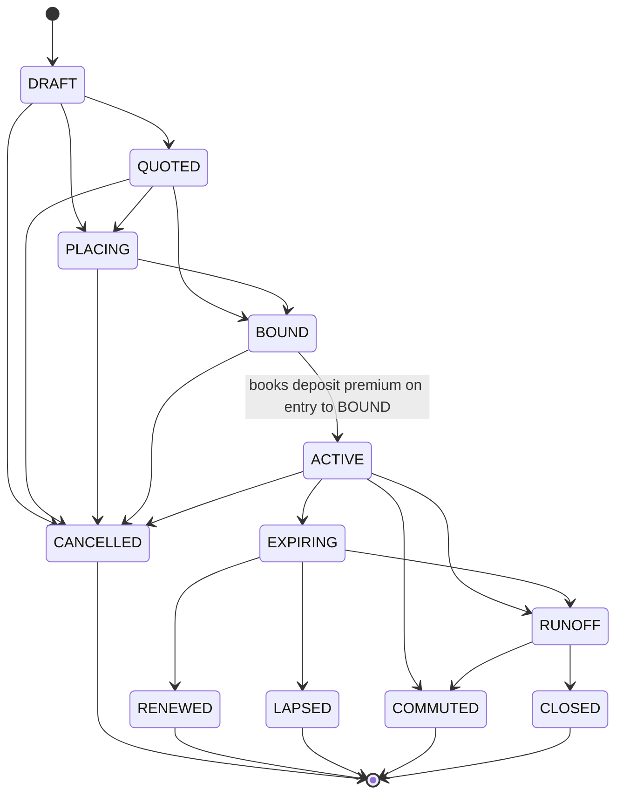
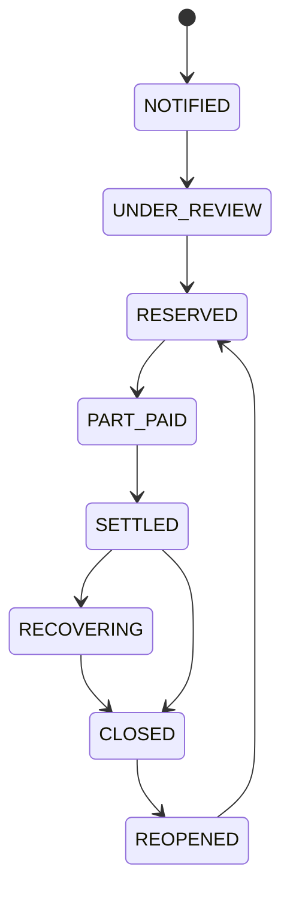

# RIOS - API Reference

**Phase:** 6 / 10 (contracts → implemented) · **Version:** 1.0
**Roles consulted:** Enterprise Solution Architect, Security Architect, Technical Writer, QA Lead
**Status:** Delivered for the implemented modules; OpenAPI generation is designed-for.

## Purpose & scope

This is the authoritative reference for every HTTP endpoint exposed by `@rios/server`
(`server/src/app.ts` + `server/src/modules/*`). It documents the auth/bearer scheme, the RBAC permission
model, the tenant-context enforcement, the error model, and every route (method, path, permission,
request, response, errors). DTO shapes are mirrored in `packages/shared/src/index.ts` - the hand-maintained
TypeScript contract that stands in for the full OpenAPI document (brief §6).

Out of scope: portal/gateway/webhook surfaces (§17) and the report/dashboard APIs - designed-for, not built.

---

## Conventions

- **Base URL:** `http://localhost:4000` in dev (`VITE_API_BASE_URL`). CORS is `{ origin: true, credentials: true }`.
- **Auth:** all `/api/*` routes except `POST /api/auth/login` require a `Authorization: Bearer <JWT>` header.
- **Money on the wire:** integer **minor units** + a currency code; response fields use a `…Minor` suffix
  (`amountMinor`, `balanceMinor`, `outstandingMinor`). Never floats. See
  [domain-calculations.md](./domain-calculations.md) §1 and [ADR 0003](./adr/0003-money-as-minor-units.md).
- **Validation:** application-level **Zod** (not Fastify JSON-schema). Failures return `400 { error, details }`
  where `details` is Zod's `flatten()`.
- **Permissions** are read from the JWT, not re-queried per request - so role changes take effect on next
  login (within the 12h token lifetime).

## Auth & bearer scheme

`POST /api/auth/login` verifies the password in SQL with **pgcrypto** (`password_hash = crypt($pw, password_hash)`),
requires `status = 'active'`, and (if `tenantCode` is supplied) matches the tenant code. On success it issues a
**JWT signed with `JWT_SECRET`, expiring in 12h** (`config.jwtExpiresIn`). The **entire `AuthUser` is the JWT
payload**, so the token carries `id, email, displayName, tenantId, roles[], permissions[]` (plus `iat`/`exp`).

Each subsequent request: the `authenticate` middleware requires `Authorization: Bearer <token>`, verifies it,
and attaches the decoded `AuthUser` as `req.auth`. There is **no server-side session/revocation store** - the
token is self-contained until expiry.

## RBAC permission model

`requirePermission(perm?)` is a Fastify preHandler. With an argument it requires that `perm` be present in the
token's `permissions` array; the wildcard **`admin:manage` overrides every check**. Denial → **403**
`{ error: "Missing permission: <perm>" }`. Called with no argument it enforces authentication only.

Permission strings in use: `config:read`, `config:write`, `party:read`, `party:write`, `treaty:read`,
`treaty:write`, `treaty:bind`, `accounting:read`, `accounting:post`, `claims:read`, `claims:write`,
`admin:manage`.

## Tenant context (RLS)

Every tenant-scoped query runs inside `runAs({ tenantId, userId }, …)`, which opens a transaction on the
low-privilege `rios_app` connection pool and sets `app.tenant_id` / `app.user_id` as **`LOCAL`** session
variables. Postgres RLS policies then restrict every row to the active tenant. See
[security.md](./security.md) and [ADR 0002](./adr/0002-multitenancy-rls.md).

## Error model

JSON body `{ error: string, details?: object }`. There is no central `sendError` helper or `code`/`requestId`
field in the body (a per-request id is set in logs). Status codes:

| Code | Meaning |
|---|---|
| 200 | Success (lists, statements, code-value create, reserve movement) |
| 201 | Resource created (party, treaty, claim) |
| 400 | Validation / bad input (`{ error, details }` for Zod failures) |
| 401 | Missing/invalid bearer token, bad credentials |
| 403 | Permission denied |
| 404 | Not found |
| 409 | Illegal treaty state transition |
| 500 | Fallback (`{ error: <message> }`) |

---

## Endpoints

### Core / app-level

| Method | Path | Permission | Notes |
|---|---|---|---|
| `GET` | `/health` | none (public) | `{ status:'ok', service:'rios-server', time }` |
| `POST` | `/api/auth/login` | none (public) | See below |
| `GET` | `/api/auth/me` | auth only | `{ user: AuthUser }` |
| `GET` | `/api/dashboard/summary` | auth only | KPIs (see below) |

**`POST /api/auth/login`** - body `{ email, password, tenantCode? }` → `{ token, user: AuthUser }`.
Errors: `400 { error:'Invalid login', details }`, `401 { error:'Invalid credentials' }`.

**`GET /api/dashboard/summary`** →
```jsonc
{
  "kpis": { "treaties", "activeTreaties", "parties", "openClaims",
            "gwpMinor", "outstandingMinor", "currency": "USD" },
  "recentTreaties": [{ "reference", "name", "status", "currency" }],   // up to 5
  "treatiesByStatus": [{ "status", "n" }]
}
```
`activeTreaties` = status in (BOUND, ACTIVE); `openClaims` = status not in (CLOSED, SETTLED); `gwpMinor` sums
premium-type financial events.

### Reference / configuration (`config:*`)

| Method | Path | Permission | Request | Response |
|---|---|---|---|---|
| `GET` | `/api/config/code-lists` | `config:read` | - | `{ lists: Record<key, CodeValueDTO[]> }` |
| `GET` | `/api/config/code-lists/:key` | `config:read` | - | `{ key, values: CodeValueDTO[] }` |
| `POST` | `/api/config/code-lists/:key/values` | `config:write` | `{ code, label, meta? }` | inserted `{ code, label, meta }` |
| `GET` | `/api/config/currencies` | `config:read` | - | `{ currencies: [{ code, name, minorUnits, symbol }] }` |

Only active, in-effect code values are returned. `POST …/values`: missing `code`/`label` → `400`; unknown
list key → `404 { error:'Unknown code list: <key>' }`; `sort_order` is auto-assigned (max+1). This is the API
that adds a status/dropdown value **without a deployment** (§10) - see [configuration-guide.md](./configuration-guide.md).

### Parties (`party:*`)

| Method | Path | Permission | Request | Response |
|---|---|---|---|---|
| `GET` | `/api/parties` | `party:read` | query `q?`, `role?` | `{ parties: PartyDTO[] }` |
| `GET` | `/api/parties/:id` | `party:read` | - | party + `identifiers` + `roles[]`; `404` if missing |
| `POST` | `/api/parties` | `party:write` | `createPartySchema` | `201 { id, reference }` |

`createPartySchema`: `{ legalName (min1), shortName?, kind: organisation|individual|syndicate|pool|captive
(default organisation), country? (2 chars), roles: string[] (default []) }`. Reference auto-generated
(`PTY-{YYYY}-{SEQ:5}`). Audits `create`/`party`. The party/role design lets one entity hold many roles
(cedent, reinsurer, broker…).

### Treaties (`treaty:*`)

| Method | Path | Permission | Request | Response |
|---|---|---|---|---|
| `GET` | `/api/treaties` | `treaty:read` | query `status?`, `kind?` | `{ treaties: [...] }` |
| `GET` | `/api/treaties/:id` | `treaty:read` | - | `ContractDTO` + `layers[]`, `participations[]`, `terms`; `404` if missing |
| `POST` | `/api/treaties` | `treaty:write` | `createContractSchema` | `201 { id, reference, status:'DRAFT' }` |
| `POST` | `/api/treaties/:id/transition` | `treaty:bind` | `{ to }` | `{ id, status, financialEvents[] }` |

`createContractSchema`: `{ name (min1), contractKind: TREATY|FACULTATIVE|RETROCESSION (default TREATY),
basis: PROPORTIONAL|NON_PROPORTIONAL (required), proportionalType?: QUOTA_SHARE|SURPLUS,
npType?: PER_RISK_XL|CAT_XL|AGG_XL|STOP_LOSS, lineOfBusiness?, direction: INWARDS|OUTWARDS (default INWARDS),
currency (3 chars), cedentPartyId?, brokerPartyId?, periodStart?, periodEnd?, terms? }`. A supplied `terms`
object is persisted as a `term_set` row.

**Transition** drives the contract state machine (see below). Illegal transition → **409**
`{ error:'Illegal transition <from> → <to>. Allowed: …' }`. Transitioning **to `BOUND` books the deposit
premium** (a `DEPOSIT_PREMIUM`/`DR` financial event) via the domain calc, and the response's
`financialEvents[]` reflects it. Audits `bind` (to BOUND) or `transition`.

#### Contract state machine (§28.3)



Deposit derivation (latest `term_set`): if `terms.depositPremium` is a number, use it; else if both
`terms.estimatedPremiumIncome` and `terms.depositPct` are numbers, `EPI × depositPct%`; else 0 (no event).

### Accounting (`accounting:*`)

| Method | Path | Permission | Request | Response |
|---|---|---|---|---|
| `GET` | `/api/treaties/:id/financial-events` | `accounting:read` | - | `{ events: FinancialEventDTO[] }` |
| `GET` | `/api/treaties/:id/statement` | `accounting:read` | - | statement (see below) |
| `POST` | `/api/treaties/:id/post` | `accounting:post` | - | posting result |

**`GET …/statement`** → `{ contractId, currency, balanceMinor, eventCount, lines:[{type,count,totalMinor}],
posted: boolean, reconciled: boolean|null, controlMovementMinor }`. `reconciled` is **`null`** when nothing
has been posted yet. Built by `buildStatement` + `reconcile` from `@rios/domain`.

**`POST …/post`** → posts unposted events to the GL as balanced journal legs (control account `1100`), then
re-verifies: `{ journalId, posted, reconciled, statementBalanceMinor, controlMovementMinor }`. Idempotent -
if all events are already posted, returns `{ posted: 0, message:'All events already posted' }`. Audits
`post`/`journal`. See [domain-calculations.md](./domain-calculations.md) §4 for the reconciliation contract.

Posting rules: premium types → DR `1100` / CR `4000`; commissions/tax → DR `5000` / CR `1100`; paid/cash loss
→ DR `5100` / CR `1100`; recovery → DR `1100` / CR `5100`.

### Claims (`claims:*`)

| Method | Path | Permission | Request | Response |
|---|---|---|---|---|
| `GET` | `/api/claims` | `claims:read` | query `status?`, `contractId?` | `{ claims: ClaimDTO[] }` |
| `GET` | `/api/claims/:id` | `claims:read` | - | claim + `movements[]`; `404` if missing |
| `POST` | `/api/claims` | `claims:write` | `createClaimSchema` | `201 { id, reference, status:'NOTIFIED' }` |
| `POST` | `/api/claims/:id/reserve-movement` | `claims:write` | `reserveSchema` | `{ outstandingMinor, paidMinor, status }` |

`createClaimSchema`: `{ contractId (uuid), description?, lossDate?, currency (3), grossLoss (>=0, default 0) }`.
A non-zero `grossLoss` also writes an `OPEN` reserve movement.

`reserveSchema`: `{ movementType: OPEN|INCREASE|DECREASE|PAYMENT|CLOSE, outstandingDelta (default 0),
paidDelta (default 0), reason? }`. A non-zero `paidDelta` also writes a `PAID_LOSS`/`CR` financial event
(feeding the statement). New status: CLOSE→CLOSED, PAYMENT→PART_PAID, else RESERVED. Audits `update`/`claim`.

#### Claim state machine (§28.4)


States are reference data (`claim_status` code list), not a DB enum - extensible per §10. The implemented
reserve-movement endpoint sets a subset (RESERVED / PART_PAID / CLOSED); the full machine is configuration-driven.

### Assistant (auth only; see [ADR 0005](./adr/0005-assistant-guardrails.md))

| Method | Path | Permission | Request | Response |
|---|---|---|---|---|
| `POST` | `/api/assistant` | auth only | `{ message }` | `AssistantResponse` (prepares, does not execute) |
| `POST` | `/api/assistant/confirm` | auth only + per-kind permission | `{ kind, preview }` | `{ ok:true, kind, id }` |

`POST /api/assistant` runs a **deterministic intent engine** grounded in tenant data (counts, open claims,
exposure by zone, statement navigation, create-treaty/party proposals). Mutating intents return an
`AssistantAction` with `requiresConfirmation: true` and a `preview` - **nothing is written**.

`POST /api/assistant/confirm` executes a prepared action **after re-checking the permission server-side**
(e.g. `create_treaty` requires `treaty:write`). Under-permissioned → **403**; unknown kind → `400`. Audits
with `context:{ assistant:true }`. The assistant uses only the caller's permissions - no backdoor - and works
fully with AI disabled.

---

## Worked vertical slice (proven by `server/test/integration.test.ts`)

1. `POST /api/auth/login` (`admin@demo.rios` / `demo1234` / `demo`) → token.
2. `POST /api/treaties` with `terms:{ depositPremium:500000, currency:'USD' }` → `201`, DRAFT.
3. `POST …/transition {to:'QUOTED'}` then `{to:'BOUND'}` → BOUND; `financialEvents[0].amountMinor == 50_000_000` ($500,000).
4. `GET …/statement` → `balanceMinor == 50_000_000`.
5. `POST …/post` → `reconciled == true`, `controlMovementMinor == statementBalanceMinor`.
6. Illegal `DRAFT → BOUND` → `409`. Under-permissioned assistant confirm (`acct@demo.rios`) → `403`.

## Traceability

- Brief §6 (REST API contracts) → this file + `@rios/shared`.
- Brief §7.3/§7.6 (lifecycle, technical→financial) → treaties + accounting endpoints.
- Brief §12.4 (assistant confirmation) → assistant endpoints + [ADR 0005](./adr/0005-assistant-guardrails.md).
- Brief §14 (auth, RBAC, RLS, audit) → [security.md](./security.md).

## Cross-cutting compliance note

Every mutating route is permission-gated, tenant-scoped via RLS, and audited. Money is integer minor units.
The assistant cannot mutate without confirmation. Numbers reconcile end to end.

## Open Questions / Assumptions / Gaps

- **No generated OpenAPI** yet; `@rios/shared` is the hand-maintained contract. Designed-for.
- **No pagination, rate-limiting, idempotency keys, or API versioning** on the routes yet (brief §6/§17).
- **No gateway, webhooks, or portal-scoped APIs** (§17.2).
- Permissions are cached in the JWT for up to 12h; immediate revocation would need a short TTL + refresh or a
  revocation list (designed-for).
- Reporting/BI and config-document (form/workflow) APIs are not implemented.
