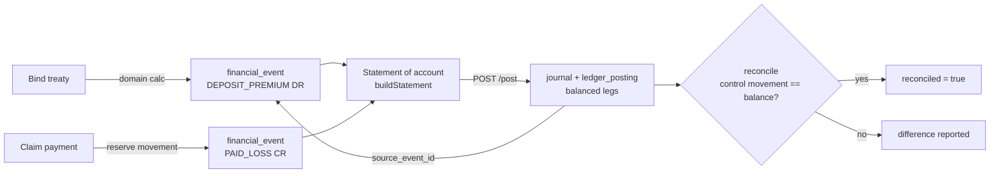
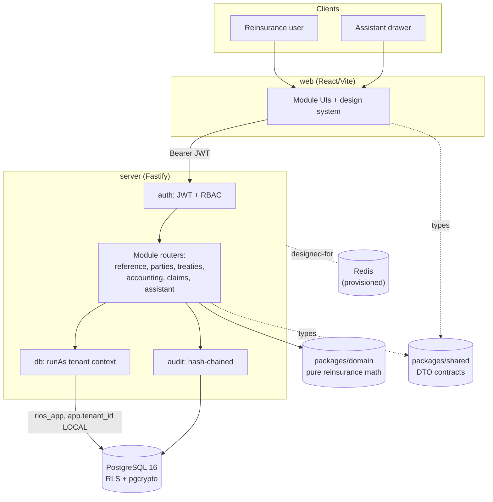
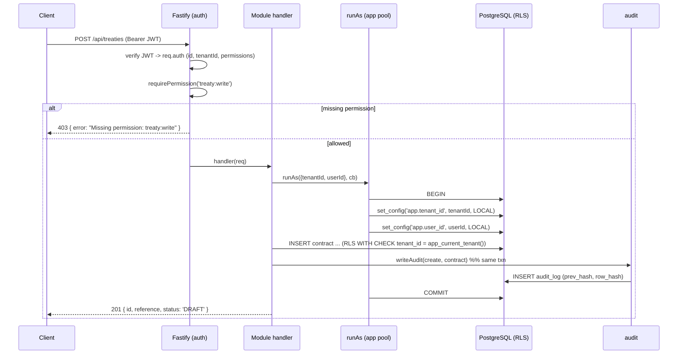

# RIOS - Solution & Technical Architecture

**Phase:** 3 / 5 (Module & Service Architecture) · **Version:** 1.0
**Roles consulted:** CTO, Enterprise Solution Architect, Security Architect, Database Architect, DevOps
**Status:** Foundation / vertical slice. Microservices, event bus, and observability are designed-for (recorded ADRs).

## Purpose & scope

The solution and technical architecture (brief §15): the architectural style and the deliberate
modular-monolith-now / microservices-ready stance, the clean-architecture / DDD bounded contexts mapped to
the module domains (§9), the tech stack, the multi-tenancy & RLS model, the reconcilable technical→financial
chain, the request/auth flow, and observability/outbox notes.

This document describes the **reality** of what is built and explicitly marks what is designed-for. RIOS today
is a correct, secure, audited **vertical slice** - not a finished commercial product. Where the build deviates
from the brief's full target (e.g. one deployable instead of a microservice fleet), the deviation is a
recorded, justified decision (§3.2), captured in the ADRs.

---

## 1. Architectural style - modular monolith, microservices-ready

The brief targets a microservices topology with a Kafka backbone (§15.2). RIOS is built as a **modular
monolith** with **clean-architecture / DDD boundaries** that map 1:1 to the functional domains, so the seams
along which services would later split already exist in code. This is a deliberate, recorded deviation
([ADR 0001](./adr/0001-architecture-style.md)): the Phase 10 exit gate is a *correct* vertical slice, and
premature decomposition would multiply operational surface before it earns its keep (§4.4, §3.2).

The layering is strict:

- **Domain core (`packages/domain`)** - pure reinsurance mathematics. No I/O, framework, clock, or DB.
  Deterministic and unit-tested (38 tests) so financial correctness is provable in isolation (§4.4).
- **Application/server (`server/src`)** - Fastify, organised into **module routers** (`reference`,
  `parties`, `treaties`, `accounting`, `claims`, `assistant`), each a candidate bounded context / future
  service. Cross-cutting concerns (`auth`, `db`/tenant-context, `audit`) are shared platform code.
- **Contracts (`packages/shared`)** - the DTO types shared by server and web (the lightweight stand-in for
  the OpenAPI contract, and an approximation of future inter-service contracts).
- **Web (`web`)** - React/Vite client (design system delivered; application UI in progress).

### Bounded contexts ↔ module domains (§9)

| Bounded context (code) | Brief domain (§9) | Status |
|---|---|---|
| `reference` | Platform & Administration (§9.1) | Delivered (code lists, currencies, add-value) |
| `parties` | Reinsurance Core / Relationship (§9.6/§9.11) | Delivered (party/role-centric) |
| `treaties` | Reinsurance Core (§9.6) | Delivered (lifecycle state machine, bind→deposit) |
| `accounting` | Accounting & Finance (§9.8) | Delivered (statement, GL post, reconcile) |
| `claims` | Claims & Recoveries (§9.7) | Delivered (reserve movements, paid-loss events) |
| `assistant` | Intelligence & Assistant (§9.5) | Delivered (deterministic, guardrailed) |
| identity / RBAC / audit / RLS | Identity, Access & Security (§9.2) | Delivered (cross-cutting) |

CQRS/event-sourcing is applied **selectively** (§15.1): the `financial_event` log and `reserve_movement`
history are append-only event records; full CQRS read models and a real event bus are designed-for.

## 2. Technology stack

| Layer | Choice | Notes |
|---|---|---|
| Language | TypeScript (ES2022, strict) | One language across domain/server/web; npm workspaces monorepo |
| Domain | `@rios/domain` (pure TS) | No deps; vitest unit tests |
| Server | Fastify 5, `pg`, `jsonwebtoken`, `zod` | tsx for dev/run |
| Database | PostgreSQL 16 | system of record; pgcrypto + citext; RLS |
| Cache/queue | Redis 7 | provisioned in compose; not yet wired |
| Web | React 18, Vite 6, React Router, TanStack Query | tokenised design system |
| Tests | vitest | 461 domain + 203 server integration |
| Local infra | docker-compose (db, redis) | IaC/K8s designed-for |

Designed-for substrate from §15.3 not yet present: Kafka/event bus, ElasticSearch/OpenSearch, object storage,
Kubernetes, CI/CD, IaC.

## 3. Multi-tenancy & RLS model

Shared-schema multi-tenancy with **PostgreSQL Row-Level Security** as the default
([ADR 0002](./adr/0002-multitenancy-rls.md)). Every tenant-scoped table carries `tenant_id` and is protected
by a `tenant_isolation` RLS policy keyed on `current_setting('app.tenant_id')`. Two connections:

- **`DATABASE_URL`** (owner) - migrations, seeding, and the pre-tenant login lookup. Bypasses RLS.
- **`DATABASE_APP_URL`** (the low-privilege **`rios_app`** role) - all tenant-scoped queries. RLS is
  *enforced* because `rios_app` is neither owner nor superuser.

A per-request helper, **`runAs`**, opens a transaction on the app pool and sets `app.tenant_id` / `app.user_id`
as **`LOCAL`** settings (transaction-scoped, pool-safe). Isolation is therefore enforced by the database, not
by application `WHERE` clauses. Schema- and database-per-tenant remain designed-for premium options (§15.4).

## 4. The reconcilable technical→financial chain (§7.6)

The single most important domain guarantee. A binding event books a `DEPOSIT_PREMIUM` financial event; events
net into a statement of account; posting derives balanced GL journal legs that carry `source_event_id`
lineage; reconciliation asserts the control-account movement equals the statement balance.

The maths lives in `@rios/domain` (`buildStatement`, `assertBalanced`, `reconcile`); the server only
orchestrates and persists. Detail in [domain-calculations.md](./domain-calculations.md) §4 and proven by the
integration test.

## 5. Context diagram

## 6. Request flow with RLS

If `runAs` is not used (no tenant context), `app_current_tenant()` returns NULL and RLS shows **no rows**
(fail-closed). Audit is written inside the same transaction, so a rollback discards both the change and its
audit row together.

## 7. Auth & RBAC flow

Login verifies the password with pgcrypto (`crypt`), loads roles + permissions, and signs a 12h JWT carrying
the whole `AuthUser` (incl. `permissions[]`). Each request re-verifies the bearer token; `requirePermission`
checks the permission against the token (with `admin:manage` as a global override). Permissions are cached in
the token, so changes apply on next login. Full detail in [security.md](./security.md) and
[api-reference.md](./api-reference.md).

## 8. Observability & outbox

- **Logging:** Fastify structured logging with per-request ids (`genReqId`). Metrics, distributed tracing,
  SLOs, and dashboards (§15.6) are **designed-for**.
- **Outbox:** an `outbox` table exists for the transactional-outbox pattern (reliable event publication tied
  to the local transaction, §15.2/§9.3). The **relay/dispatcher and the event bus are not yet built** - the
  substrate is in place for the future microservice split.
- **Audit:** every material mutation writes a hash-chained `audit_log` row (tamper-evident, append-only) -
  the observability of *what changed and by whom* is delivered.

## Traceability

Brief §15 (architecture), §9 (module domains), §7.6 (technical→financial), §14 (security cross-cuts),
§16 (data). Records the §3.1/§3.2 deviation from full microservices. ADRs:
[0001](./adr/0001-architecture-style.md), [0002](./adr/0002-multitenancy-rls.md),
[0003](./adr/0003-money-as-minor-units.md), [0004](./adr/0004-metadata-driven-config.md),
[0005](./adr/0005-assistant-guardrails.md).

## Cross-cutting compliance note

Clean boundaries (§15.1); RLS tenant isolation (§14.2/§14.5); append-only audit (§14.3); reconcilable money
chain (§7.6, §16); metadata-driven config (§10); assistant within permissions (§12). No monetary floats.

## Open Questions / Assumptions / Gaps

- **Microservices, API gateway, Kafka, outbox relay** - designed-for; today one deployable. See
  [ADR 0001](./adr/0001-architecture-style.md).
- **Observability** (metrics/traces/SLOs), **IaC/Kubernetes/CI-CD**, **Redis/search/object-storage wiring**,
  **DR (RTO/RPO)** - designed-for. See [phases.md](./phases.md) and [open-questions.md](./open-questions.md).
- **CQRS read models / event sourcing** beyond the append-only event logs - designed-for.
