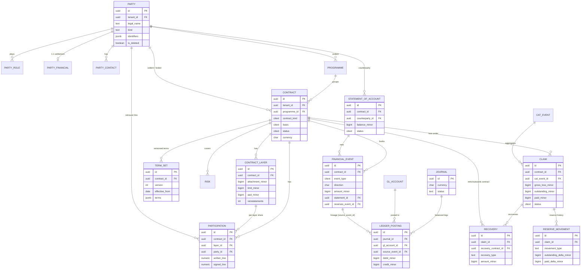

# RIOS — Data Model

**Phase:** 4 (Database Design) · **Version:** 1.0
**Roles consulted:** Database Architect, Security Architect, Reinsurance Domain Expert, Technical Writer
**Status:** Delivered (8 migrations + seed); partitioning and bi-temporal patterns designed-for.

## Purpose & scope

The production PostgreSQL data design (brief §16). It documents every bounded context's entities, the
party/role-centric core, the money/FX and effective-dating patterns, the audit/soft-delete patterns, the
indexing/partitioning strategy, the tenant-isolation model, and the contract/claim state machines.

Authoritative source: `db/migrations/0001…0008.sql` and `db/seed/seed.sql`. The server's runtime DTOs are in
`packages/shared/src/index.ts`.

Two extensions are enabled in `0001`: **pgcrypto** (`gen_random_uuid`, `crypt`, `gen_salt`) and **citext**
(case-insensitive codes/emails). Money is **`bigint` minor units** throughout (`*_minor`); FX is
`numeric(20,10)`; lines/shares `numeric(9,6)`; rate-on-line `numeric(12,8)`.

---

## Bounded contexts → migrations

| Context | Migration | Key tables |
|---|---|---|
| Tenancy & Identity | `0001` | `tenant`, `app_user`, `role`, `permission`, `role_permission`, `user_role`, `org_unit` |
| Reference Data / Config | `0002` | `code_list`, `code_value`, `currency`, `exchange_rate`, `numbering_scheme`, `config_document` |
| Parties | `0003` | `party`, `party_role`, `party_contact`, `party_financial` |
| Reinsurance Core | `0004` | `programme`, `contract`, `contract_layer`, `participation`, `term_set`, `risk` |
| Accounting | `0005` | `financial_event`, `statement_of_account`, `gl_account`, `journal`, `ledger_posting` |
| Claims | `0006` | `cat_event`, `claim`, `reserve_movement`, `recovery` |
| Audit | `0007` | `audit_log`, `outbox` |
| RLS | `0008` | row-level-security policies + `rios_app` role |

---

## 1. Tenancy & Identity (`0001`)

- **`tenant`** — root of all tenant-scoped data. `id` (PK), `code` (citext, unique), `name`, `isolation`
  (`shared|schema|database`, default `shared`), `status` (`active|suspended|offboarding`),
  `default_currency`, `default_locale`. Has **no** `tenant_id` — it *is* the tenant.
- **`app_user`** — `tenant_id`→tenant, `email` (citext), `display_name`, `password_hash` (nullable for SSO),
  `status` (`active|disabled|invited`), `last_login_at`. Unique `(tenant_id, email)`.
- **`role`** — tenant-scoped RBAC role; unique `(tenant_id, code)`; `is_system`.
- **`permission`** — **global** catalog (no `tenant_id`), PK `code`, with `module`, `action`.
- **`role_permission`** — join (PK `(role_id, permission)`).
- **`user_role`** — join (PK `(user_id, role_id)`) with `scope jsonb` — the **ABAC** refinement slot
  (org-unit/LOB constraints), not yet enforced in the app.
- **`org_unit`** — self-referential hierarchy (`parent_id`), `kind` (`group|company|branch|department`).

## 2. Reference Data / Config (`0002`) — the metadata layer

- **`code_list`** / **`code_value`** — the configurable lists (statuses, types, classes). `code_value` is
  **effective-dated**: `effective_from` (default `0001-01-01`), `effective_to` (null = open), `is_active`,
  `meta jsonb`, `sort_order`. Unique `(code_list_id, code, effective_from)` so the same code can be
  time-sliced.
- **`currency`** — PK `(tenant_id, code)`, `minor_units` (drives money math), `symbol`.
- **`exchange_rate`** — effective-dated by `rate_date`; unique `(tenant_id, from_ccy, to_ccy, rate_date)`;
  `rate numeric(20,10)`, check `rate > 0`; DESC index for "latest as of".
- **`numbering_scheme`** — configurable reference patterns (`prefix`, `pattern`, `next_seq`).
- **`config_document`** — **versioned** metadata for forms/workflows/rules/templates: `kind`, `key`,
  `version`, `status` (`draft|published|archived`), `body jsonb`, `effective_from`. Unique
  `(tenant_id, kind, key, version)`. (Storage delivered; interpreters designed-for.)

See [configuration-guide.md](./configuration-guide.md) and [ADR 0004](./adr/0004-metadata-driven-config.md).

## 3. Parties (`0003`) — party/role-centric (§7 design implication)

A legal entity (`party`) is separated from the **roles** it plays (`party_role`), so one party can be cedent,
reinsurer, retrocessionaire, broker, and coverholder simultaneously — never "customer vs vendor".

- **`party`** — `legal_name`, `short_name`, `kind` (`organisation|individual|syndicate|pool|captive`),
  `country`, `identifiers jsonb` (LEI/NAIC/Lloyd's/tax), `status`, soft-delete `is_deleted`.
- **`party_role`** — N roles per party; `role_code` (citext, from the `party_role` code list);
  unique `(party_id, role_code)`; `is_active`.
- **`party_contact`** — `kind` (`email|phone|address|portal_user`), `value`, `is_primary`.
- **`party_financial`** — **1:1** with party (PK = `party_id`); `settlement_ccy`, `payment_terms_days`
  (default 30), `bank_details jsonb`.

## 4. Reinsurance Core (`0004`)

- **`programme`** 1—N **`contract`** (`contract.programme_id` → programme, `ON DELETE SET NULL`).
- **`contract`** — `contract_kind` (TREATY/FACULTATIVE/RETROCESSION), `basis` (PROPORTIONAL/NON_PROPORTIONAL),
  `proportional_type`, `np_type`, `direction` (`INWARDS|OUTWARDS`, the only DB check here), `currency`,
  period, `status` (default DRAFT), `wording_ref`, `market_refs jsonb`, soft-delete. Two party FKs:
  `cedent_party_id`, `broker_party_id`.
- **`contract`** 1—N **`contract_layer`** (`ON DELETE CASCADE`; unique `(contract_id, layer_no)`):
  `attachment_minor`, `limit_minor`, `aad_minor`, `reinstatements` (null = unlimited),
  `reinstatement_rates jsonb`, `rate_on_line`.
- **`participation`** — a reinsurer's share of a contract/layer (`layer_id` nullable);
  `written_line`, `signed_line`, `order_pct` (signing-down); `party_id` → party; `status` (default WRITTEN).
- **`term_set`** — versioned, effective-dated commercial terms (`terms jsonb`); contract- or layer-level via
  the unique index `term_set_unique_version (contract_id, coalesce(layer_id, …), version)`.
- **`risk`** — underlying exposure; `peril_zone` (indexed for aggregation), `sum_insured_minor`.

## 5. Accounting (`0005`) — the reconcilable chain (§7.6)

```
financial_event  ──(netted into)──▶  statement_of_account
        │
        └──(posted as)──▶  journal 1—N ledger_posting ──(source_event_id back to)──▶ financial_event
```

- **`financial_event`** — immutable technical fact: `event_type` (citext, from `financial_event_type` list),
  `direction` (`DR|CR` check), `amount_minor` (`>= 0`), `currency`, optional `settlement_ccy/rate/amount`,
  `booked_at`, `reverses_event_id` (self-FK for corrections — never edited), `statement_id` (set when netted),
  `claim_id` (deferred FK, added in `0006`). Anchored to `contract_id` (required).
- **`statement_of_account`** — netting between `contract_id` and `counterparty_id`; `balance_minor`
  (positive = cedent owes reinsurer), `status` (from `statement_status` list), `issued_at`, `settled_at`.
- **`gl_account`** — self-referential chart; `type` (`asset|liability|income|expense|equity`), `is_control`.
- **`journal`** 1—N **`ledger_posting`** — each leg is purely debit **or** credit (table check
  `debit_minor = 0 or credit_minor = 0`); `gl_account_id` and `source_event_id` (lineage to the technical
  event, §18.4).

## 6. Claims (`0006`)

- **`cat_event`** 1—N **`claim`** — a coded catastrophe aggregating losses across contracts.
- **`claim`** — anchored to `contract_id` (required), optional `layer_id`, `risk_id`, `cat_event_id`;
  denormalised running figures `gross_loss_minor`, `outstanding_minor` (case reserve), `paid_minor`,
  `recovered_minor`; `status` (default NOTIFIED, from `claim_status` list); soft-delete.
- **`reserve_movement`** — immutable, append-only signed deltas (`outstanding_delta_minor`,
  `paid_delta_minor`); `movement_type` check (`OPEN|INCREASE|DECREASE|PAYMENT|CLOSE`).
- **`recovery`** — `recovery_type` (`REINSURANCE|SALVAGE|SUBROGATION`); `recovery_contract_id` → the
  outwards/retro contract; `status` (default EXPECTED).

## 7. Audit & Outbox (`0007`)

- **`audit_log`** — `id bigint generated always as identity` (PK, monotonic ordering), `tenant_id` (no FK,
  so audit survives deletes), `occurred_at`, `actor_user_id`, `action`, `entity_type`, `entity_id`,
  `before/after jsonb`, `context jsonb`, and the **hash chain** columns `prev_hash bytea` / `row_hash bytea`.
- **`outbox`** — transactional outbox: `topic`, `payload jsonb`, `published_at`, `attempts`; partial index on
  unpublished rows. (Table delivered; the relay/publisher is designed-for.)

See [security.md](./security.md) for the hash-chain mechanism and append-only enforcement.

---

## Core ER diagram



## Contract & claim state machines

See the Mermaid `stateDiagram` for the [contract](./api-reference.md#contract-state-machine-283) and
[claim](./api-reference.md#claim-state-machine-284) machines in the API reference. States are **reference
data** (`contract_status`, `claim_status` code lists) validated at the application layer — **not** DB check
constraints — so they are configurable per §10. The server's `treaties` module enforces the legal-transition
map (illegal → `409`).

---

## Cross-cutting patterns

### Money & FX (§16.1)
Integer **minor units** in `*_minor bigint` columns + a `currency char(3)`. FX is a separate concern:
`exchange_rate` carries effective-dated `numeric(20,10)` rates; `financial_event` reserves
`settlement_ccy/rate/amount` columns for FX-settled events. No floats anywhere. See
[ADR 0003](./adr/0003-money-as-minor-units.md).

### Effective-dating & versioning (§16.1)
- `code_value` — `effective_from`/`effective_to` window.
- `exchange_rate` — point-in-time series by `rate_date`.
- `config_document` — immutable `version` accretion with `status` lifecycle.
- `term_set` — `version` + `effective_from`, contract/layer-scoped.

Full bi-temporal ("as known then vs as true then") is designed-for; the current model is effective-dated
plus append-only event history (`financial_event` reversals, `reserve_movement` deltas).

### Audit & soft-delete (§16.2)
Append-only, hash-chained `audit_log` (see [security.md](./security.md)). Soft delete is a boolean
`is_deleted` (no `deleted_at` timestamp) on `party`, `programme`, `contract`, `claim`, each with a
`WHERE NOT is_deleted` partial index. Financial facts are never deleted — corrected by reversal/append.

### Indexing & partitioning (§16.2)
Tenant-prefixed composite indexes on every hot path (`(tenant_id, status)`, `(tenant_id, contract_id)`,
`exchange_rate(tenant_id, from_ccy, to_ccy, rate_date DESC)`, `risk(tenant_id, peril_zone)`, partial indexes
on live rows and unpublished outbox). **Partitioning is designed-for, not yet applied** — the high-volume
tables (`financial_event`, `ledger_posting`, `audit_log`, `reserve_movement`) are the intended candidates
(by tenant and/or period) per §16.2.

### Tenant isolation (§16.3)
Every tenant table carries `tenant_id` and is protected by RLS (`0008`). Exceptions: `tenant` (keyed on `id`),
the global `permission` catalog (read-only, no RLS), and `audit_log`/`outbox` (RLS-protected but FK-detached
so they survive tenant purges). Full mechanism in [security.md](./security.md) /
[ADR 0002](./adr/0002-multitenancy-rls.md).

## Seed data (demo tenant `demo`)

Tenant `Demo Reinsurance Co.`; users `admin@demo.rios`, `uw@demo.rios`, `acct@demo.rios`, `claims@demo.rios`
(password `demo1234`) mapped to roles ADMIN / TREATY_UW / ACCOUNTANT / CLAIMS. 12 permissions, 4 roles, 4
currencies, FX rates, numbering schemes, 8 code lists, 5 parties (incl. Helvetia Re as both reinsurer **and**
cedent of its own retro — proving the role-centric design), and one BOUND CAT XL treaty
(`TRTY-2026-00001`) with two layers, participations, a term set, and a 6-account GL chart. Transactional/claims
data is created by exercising the app, not seeded.

## Traceability

Brief §16 (data design), §7 (domain semantics), §14.2/§14.5 (RLS/isolation), §28 (illustrative model & state
machines). Forward: [api-reference.md](./api-reference.md), [security.md](./security.md).

## Open Questions / Assumptions / Gaps

- **Partitioning** of large tables is designed-for, not implemented.
- **Bi-temporal** history (valid-time + transaction-time) is approximated by effective-dating + append-only
  events; full bi-temporal is designed-for.
- **ABAC scope** (`user_role.scope`, `org_unit`) is modelled but not enforced in queries yet.
- **FLS / column masking** is not in the schema (designed-for, §14.2).
- **Bordereaux**, IFRS 17 / Solvency II measurement tables, exposure/aggregate stores, and document/object
  storage are not modelled — see [open-questions.md](./open-questions.md).
- State enumerations live in code lists, not DB checks — flexible (§10) but means DB-level integrity of status
  values relies on the application; a config-validated trigger could harden this.
